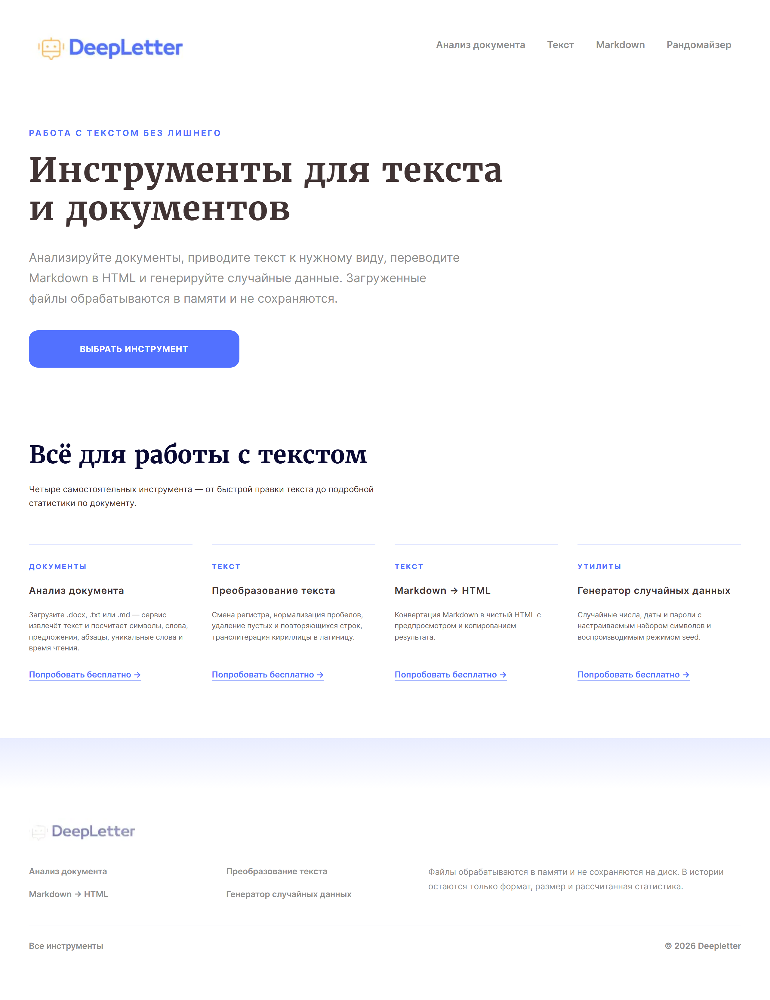
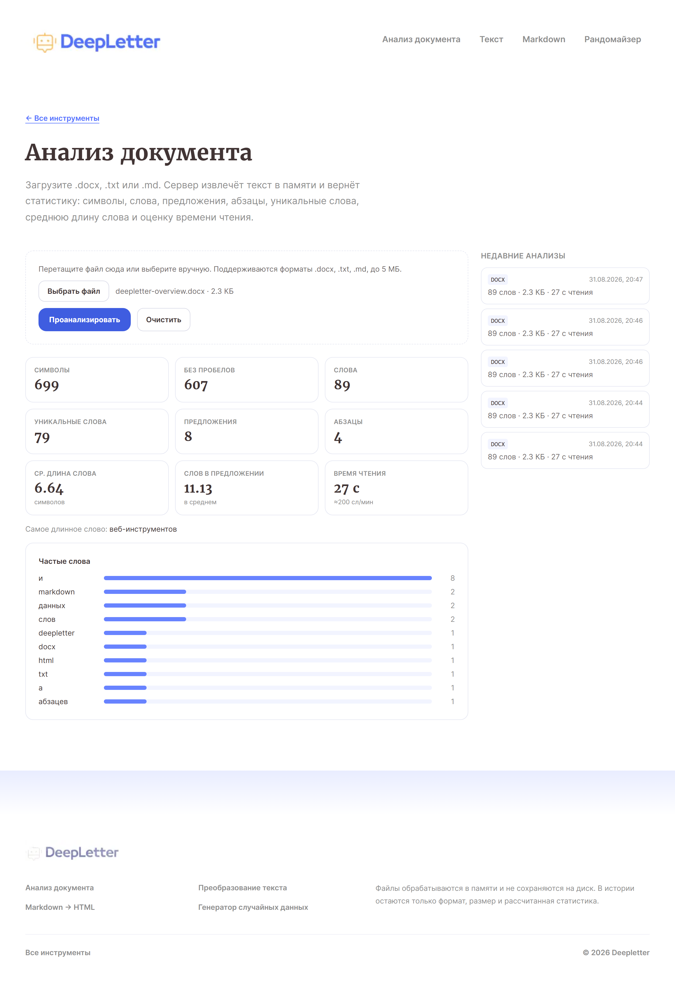
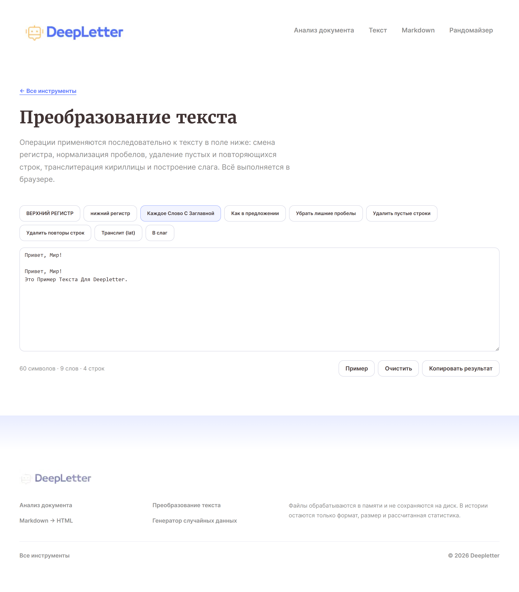
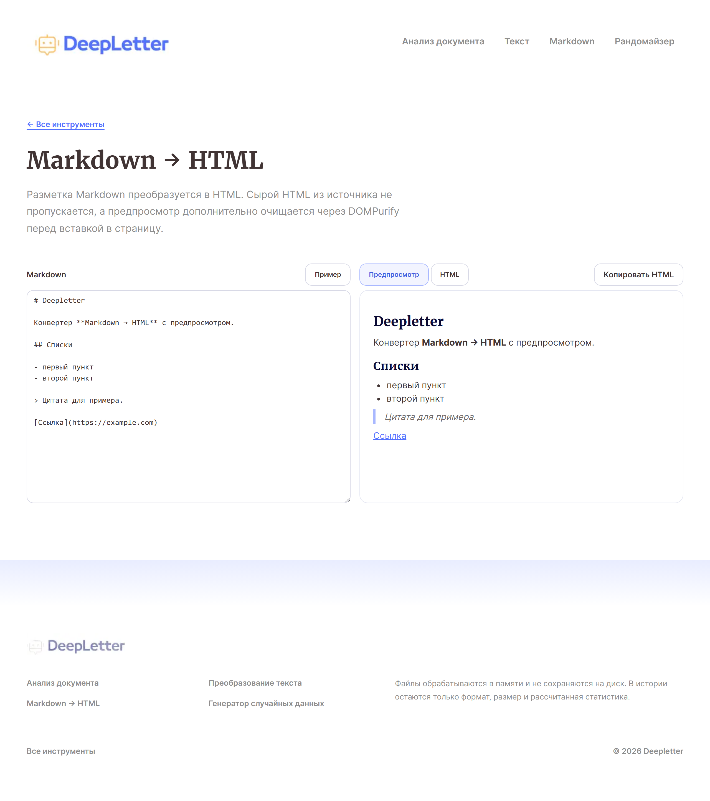
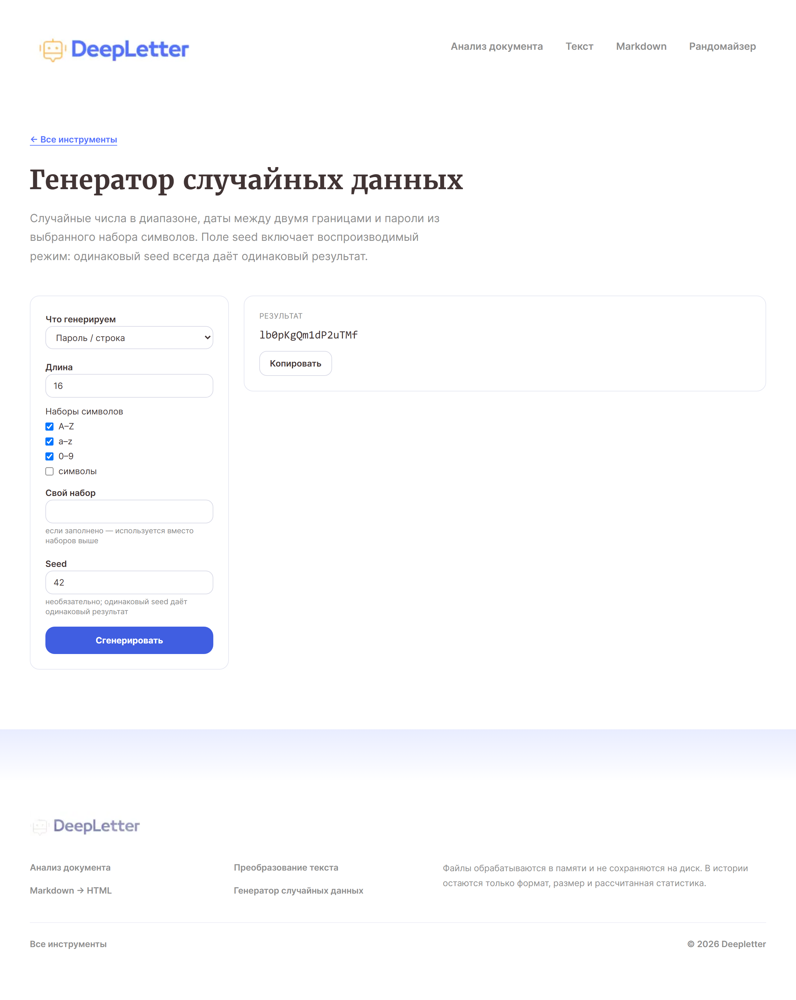

# Deepletter

[](https://github.com/AlexKazDrumm/web-pet-Deepletter/actions/workflows/ci.yml)

Веб-приложение с инструментами для работы с текстом и документами. В состав
проекта входят клиент на Next.js, API на Express, общий пакет с логикой
обработки текста и PostgreSQL.



## Инструменты

| Раздел                | Возможности                                                                                                        |
| --------------------- | ------------------------------------------------------------------------------------------------------------------ |
| Анализ документа      | `.docx`, `.txt` и `.md`: символы, слова, предложения, абзацы, частотный список, средняя длина слова и время чтения |
| Преобразование текста | смена регистра, нормализация пробелов, удаление пустых и повторяющихся строк, транслитерация и slug                |
| Markdown → HTML       | преобразование Markdown, предпросмотр и копирование результата                                                     |
| Случайные данные      | числа, даты и пароли; поддерживается воспроизводимая генерация по `seed`                                           |

Файл для анализа обрабатывается в памяти. В базе сохраняются формат, размер и
рассчитанные показатели; имя и содержимое файла не записываются.



## Структура

```text
shared/   типы, схемы Zod и функции обработки текста
server/   Express API, миграции и работа с PostgreSQL
web/      интерфейс на Next.js
```

## Стек

- Next.js 16, React 19, Tailwind CSS 4, TypeScript
- Node.js 24, Express 5
- PostgreSQL 16, `pg`, `node-pg-migrate`
- Zod, Mammoth, Helmet, Pino
- Vitest, Testing Library, Supertest, Playwright
- Docker Compose

## Запуск через Docker Compose

```powershell
Copy-Item .env.example .env
docker compose up --build
```

- клиент: <http://localhost:3000>
- API: <http://localhost:3030>

Если локальный PostgreSQL уже занимает порт `5432`, задайте другой `DB_PORT`
в `.env`.

## Локальный запуск

Понадобятся Node.js 24 (версия закреплена в `.nvmrc`) и PostgreSQL 16+.

```powershell
Copy-Item .env.example .env
npm ci
npm run build:shared
npm run migrate
npm run seed
npm run dev
```

## API

| Метод и путь                          | Назначение                   |
| ------------------------------------- | ---------------------------- |
| `GET /api/health`                     | состояние API                |
| `GET /api/tools`                      | каталог инструментов         |
| `POST /api/documents/analyze`         | загрузка и анализ документа  |
| `GET /api/documents/analyses?limit=N` | последние результаты анализа |

Поддерживаемые форматы: `.docx`, `.txt`, `.md` и `.markdown`. Стандартный лимит
размера файла — 5 МиБ; он задаётся переменной `MAX_UPLOAD_BYTES`.

## Конфигурация

Полный набор переменных находится в `.env.example`.

| Переменная                                          | Назначение                               |
| --------------------------------------------------- | ---------------------------------------- |
| `POSTGRES_USER`, `POSTGRES_PASSWORD`, `POSTGRES_DB` | параметры PostgreSQL для Docker Compose  |
| `DB_PORT`                                           | порт PostgreSQL на хосте                 |
| `DATABASE_URL`                                      | подключение API и миграций к базе        |
| `PORT`                                              | порт API                                 |
| `WEB_ORIGIN`                                        | разрешённый origin клиента               |
| `MAX_UPLOAD_BYTES`                                  | ограничение размера файла                |
| `RATE_LIMIT_WINDOW_MS`, `RATE_LIMIT_MAX`            | общие ограничения частоты запросов       |
| `ANALYZE_RATE_LIMIT_MAX`                            | ограничение запросов к анализатору       |
| `NEXT_PUBLIC_API_BASE_URL`                          | адрес API в браузере                     |
| `API_BASE_URL`                                      | адрес API для серверных запросов Next.js |

## Миграции

```powershell
npm run migrate
npm run migrate:down --workspace server
```

Миграции находятся в `server/migrations`.

## Проверки

```powershell
npm test
npm run format:check
npm run lint
npm run typecheck
npm run build
npm run test:e2e
```

Интеграционный тест PostgreSQL запускается при `RUN_DB_IT=1`. GitHub Actions
выполняет форматирование, линтинг, проверку типов, unit- и интеграционные тесты,
production-сборку и E2E-тесты в Chromium.

## Скриншоты

| Преобразование текста                                         | Markdown → HTML                                   | Случайные данные                                     |
| ------------------------------------------------------------- | ------------------------------------------------- | ---------------------------------------------------- |
|  |  |  |
